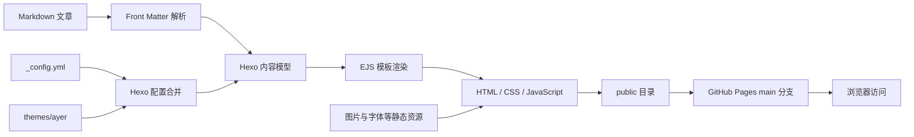

# xuanz 的个人博客

[](https://hexo.io/)
[](https://github.com/Shen-Yu/hexo-theme-ayer)
[](https://xuanz54.github.io/)
[](https://nodejs.org/)

这是 [xuanz 的个人博客](https://xuanz54.github.io/) 的项目说明文档。博客使用 Hexo 生成静态页面，以 Ayer 为基础主题，通过 Markdown 管理内容，并发布到 GitHub Pages。

本文不是简单的安装说明，而是从内容输入、Hexo 数据建模、EJS 模板渲染、浏览器端交互到 GitHub Pages 发布，完整说明博客各项功能的实现原理、配置入口和维护方式。

## 在线地址

- 博客首页：<https://xuanz54.github.io/>
- 归档页面：<https://xuanz54.github.io/archives/>
- 分类页面：<https://xuanz54.github.io/categories/>
- 标签页面：<https://xuanz54.github.io/tags/>
- 关于页面：<https://xuanz54.github.io/about/>
- GitHub 仓库：<https://github.com/xuanz54/xuanz54.github.io>

## 页面预览

### 首页封面


首页首屏由 Ayer 的 `cover` 模块生成。背景图来自主题静态资源，中央显示站点标题与循环打字副标题，左上角打开侧边栏，右上角切换明暗主题，底部箭头滚动到文章列表。Live2D 模型作为独立浮层固定在右下角。

### 文章归档


归档页按年份和发布日期组织文章。Hexo 在生成阶段读取每篇文章 Front Matter 中的 `date`，由 `hexo-generator-archive` 建立归档数据，再交给主题的归档模板渲染时间轴。

### 分类与标签


分类用于表达文章所属的主要内容领域，标签用于描述文章涉及的技术或主题。二者都来自 Markdown 文件头部的 Front Matter，由 Hexo 在构建时聚合并生成索引页、详情页和文章之间的关联链接。

### 文章详情


文章详情页由标题、日期、分类、字数、预计阅读时间、正文、标签、分享与上下篇导航等区域组成。Markdown 在构建阶段转换为 HTML，浏览器只需加载静态文件，不依赖服务端数据库。

### 关于页面


关于页同样由 Markdown 编写，但使用独立 `page` 布局。页面中提供本项目 README 的入口，使读者可以从博客直接跳转到 GitHub 查看完整实现说明。

## 技术栈

| 层级 | 技术 | 在项目中的作用 |
| --- | --- | --- |
| 内容层 | Markdown + YAML Front Matter | 编写正文，声明标题、日期、分类、标签等元数据 |
| 生成器 | Hexo 7.3 | 读取内容与配置，建立文章模型并输出静态 HTML |
| 模板层 | Ayer + EJS | 把文章、列表、归档、分类和标签数据渲染成页面 |
| 样式层 | Stylus + Ayer CSS | 实现桌面端、移动端、明暗主题和各组件外观 |
| 交互层 | JavaScript + jQuery | 实现搜索、侧栏、返回顶部、深色模式、图片预览等交互 |
| 搜索 | hexo-generator-searchdb | 在构建期生成 `search.xml`，供浏览器端检索 |
| 统计 | 主题字数 helper | 计算中文字数、英文词数与预计阅读时间 |
| 动画 | Typed.js、Pace、Live2D | 实现打字副标题、加载进度条与桌面模型 |
| 发布 | hexo-deployer-git | 将 `public/` 中的静态产物推送到 GitHub Pages |
| 托管 | GitHub Pages | 通过 HTTPS 对外提供纯静态博客 |
| 图床 | PicUI | 托管 README 和部分文章图片，Markdown 引用远程 URL |

## 整体工作原理



一次完整构建包含以下阶段：

1. Hexo 读取根目录 `_config.yml`，获得站点 URL、永久链接、分页、搜索和部署方式。
2. Hexo 读取 `themes/ayer/_config.yml`，获得菜单、封面、搜索、明暗模式、文章组件和视觉效果配置。
3. `source/_posts/` 中的 Markdown 被解析为文章对象，Front Matter 被转换为文章元数据。
4. 归档、分类、标签、首页和站点地图插件根据文章对象建立对应的数据集合。
5. Ayer 的 EJS 模板把数据渲染为 HTML，并按配置条件加载对应 CSS 和 JavaScript。
6. 主题资源、文章资源和生成页面统一写入 `public/`。
7. `hexo-deployer-git` 将 `public/` 发布到 GitHub 仓库的 `main` 分支。
8. GitHub Pages 直接返回静态文件。页面搜索、深色模式和图片预览等交互在访问者浏览器中执行。

## 目录结构

```text
blog/
├─ .github/
│  └─ dependabot.yml             # npm 依赖更新检查
├─ scaffolds/                    # 新建文章、页面和草稿的模板
├─ source/
│  ├─ _posts/                    # 所有 Markdown 文章
│  ├─ about/index.md             # 关于我页面
│  ├─ archives/                  # 归档入口由生成器建立
│  ├─ categories/index.md        # 分类聚合页入口
│  ├─ tags/index.md              # 标签聚合页入口
│  └─ README.md                  # 部署到 GitHub Pages 仓库根目录的 README
├─ themes/ayer/
│  ├─ layout/                    # EJS 页面与局部模板
│  ├─ scripts/                   # Hexo 事件、过滤器和 helper
│  ├─ source/                    # 浏览器直接使用的主题资源
│  ├─ source-src/                # 主题 Stylus 与 JavaScript 源文件
│  └─ _config.yml                # Ayer 功能开关和主题参数
├─ public/                       # 构建生成的静态站点，不在此处手工编辑
├─ _config.yml                  # Hexo 站点主配置
├─ package.json                 # 依赖和命令入口
└─ README.md                    # 项目说明文档
```

## 内容系统实现

### Markdown 与 Front Matter

每篇文章都存放在 `source/_posts/`。文件开头使用 YAML Front Matter 描述元数据，正文使用 Markdown：

```yaml
---
title: 示例文章
date: 2026-07-21 12:00:00
categories:
  - 笔记
tags:
  - AI
  - 工具
---
```

关键字段的作用如下：

| 字段 | 作用 | 最终影响 |
| --- | --- | --- |
| `title` | 文章标题 | 浏览器标题、首页卡片、归档和文章页标题 |
| `date` | 发布时间 | 首页排序、归档年份和永久链接 |
| `updated` | 更新时间 | 可供模板展示最后修改时间 |
| `categories` | 分类 | 分类聚合、面包屑和文章元信息 |
| `tags` | 标签 | 标签聚合与文章底部标签链接 |
| `description` | 摘要 | 页面描述与搜索引擎元数据 |
| `toc` | 单篇文章目录控制 | 在全局目录开启时决定是否为该文生成目录 |
| `no_word_count` | 关闭单篇字数统计 | 跳过字数和阅读时间组件 |
| `no_reward` | 关闭单篇打赏 | 跳过打赏组件 |

站点永久链接配置为 `:year/:month/:day/:title/`。Hexo 会把文章日期和文件名组合成稳定 URL，因此修改文章日期会同时改变线上地址。

### 首页文章列表

首页数据由 `hexo-generator-index` 生成，`index_generator.order_by: -date` 让文章按发布日期倒序排列，`per_page: 10` 控制每页数量。主题在首页调用文章局部模板，展示标题、日期、分类和标签，并由分页组件生成上一页与下一页链接。

当前 `excerpt_all: true`，首页采用归档式摘要列表，避免直接输出整篇长文。文章详情只有在进入固定链接后才完整渲染。

### 归档

`hexo-generator-archive` 遍历文章集合，按年份和月份分组。Ayer 的 `archive.ejs` 与 `_partial/archive.ejs` 再按时间顺序输出年份节点、日期和文章标题。因为数据在构建期已经确定，归档页无需在浏览器中请求接口。

### 分类

`hexo-generator-category` 根据 Front Matter 中的 `categories` 建立分类索引。`source/categories/index.md` 声明该页面使用分类布局，Ayer 调用 Hexo 的分类 helper 输出分类名称和文章数量。点击分类后进入该分类的文章列表。

### 标签

`hexo-generator-tag` 根据 Front Matter 中的 `tags` 建立标签集合。Ayer 在 `tags.ejs` 中调用 `list_tags` helper，将标签渲染成标签云；点击标签会进入该标签对应的文章列表页。

### 关于页与独立页面

`source/about/index.md` 不属于 `_posts`，因此不会进入文章时间线。Hexo 将它识别为独立页面，Ayer 使用 `page` 布局渲染。分类页和标签页也采用同样的“Markdown 入口 + 专用布局”方式。

## 主题与页面结构实现

### Ayer 模板组合

主题通过 EJS 的 `partial` 机制拆分页面。`layout/layout.ejs` 是外层骨架，负责组合正文、页脚、浮动按钮、侧边栏和弹窗；不同页面再分别使用 `index.ejs`、`post.ejs`、`archive.ejs`、`categories.ejs`、`tags.ejs` 和 `page.ejs`。

文章区域继续拆成标题、作者、日期、分类、字数、正文、分享、标签、评论和上下篇导航等局部模板。这样的结构让一个功能可以通过主题配置统一开关，不需要修改每篇文章。

### 封面与打字副标题

`cover.enable: true` 时，首页输出全屏封面。`cover.path` 指向背景图，`subtitle` 配置提供最多三段文字、打字速度、回退速度、延迟和循环开关。浏览器端脚本调用 Typed.js 逐字写入并删除文本，形成循环打字效果。

### 侧边栏与移动导航

`theme.menu` 定义菜单名称与目标路径。`sidebar.ejs` 遍历该对象生成主页、归档、分类、标签、壁纸和关于我链接。

浏览器端监听 `.navbar-toggle` 点击事件，在 `.content` 与 `.sidebar` 之间切换 `on` 和 `anim` 类。桌面端表现为侧栏展开/收起，窄屏下沿用相同状态机制适配移动布局。

### 响应式布局

页面 `<head>` 设置移动端 viewport，主题 CSS 使用弹性布局与断点样式调整正文、侧栏、字号和浮动按钮。`layout.article_width` 与 `layout.sidebar_width` 控制桌面端主要宽度，移动端规则则把内容切换为单列。

## 交互功能实现

### 本地全文搜索

搜索完全在静态站点内完成：

1. `hexo-generator-searchdb` 在构建阶段扫描文章并生成 `public/search.xml`。
2. 侧边栏搜索按钮为 `.nav-item-search`，点击后给搜索容器添加 `on` 类并聚焦输入框。
3. `/js/search.js` 在浏览器中加载 `search.xml`。
4. 用户输入关键词后，脚本在标题和正文索引中匹配并渲染结果。
5. 点击搜索框外部时移除 `on` 类，关闭搜索面板。

它不依赖 Algolia、Elasticsearch 或后端数据库，优点是部署简单且没有查询费用；文章数量很大时，`search.xml` 体积会增长，这是纯前端搜索需要关注的性能边界。

### 深色模式

`darkmode: true` 时页面显示月亮/太阳切换按钮。点击后脚本给 `<body>` 添加或移除 `darkmode` 类，CSS 根据该类切换背景、正文、链接和组件颜色。

用户选择保存在 `sessionStorage` 的 `darkmode` 键中，因此同一浏览器标签会话内切换页面后仍然生效；关闭会话后恢复默认模式。图标也会在 `ri-moon-line` 和 `ri-sun-line` 之间同步切换。

### 加载进度条

`progressBar: true` 时，`head.ejs` 加载 Pace。Pace 监听页面资源加载状态并在顶部绘制进度条，资源加载完成后自动隐藏，不需要业务代码手工维护进度值。

### 图片懒加载与预览

主题为图库图片输出 `lazy` 类和 `data-original` 地址，`lazyload.min.js` 在图片进入可视区域时才设置真实资源，并用淡入效果显示，以减少首屏请求。

`image_viewer: true` 时，页面加载 PhotoSwipe 结构和初始化脚本。脚本扫描文章正文中的图片，读取原图尺寸并注册点击事件；点击后打开遮罩层，可缩放、拖动、切换和关闭。图片仍可使用 PicUI 等外部图床 URL，预览逻辑不要求图片位于仓库内。

### 代码高亮与一键复制

Hexo 使用 Highlight.js 在构建阶段处理 Markdown 围栏代码块，并生成带行号的 HTML。`copy_btn: true` 时，主题在每个代码块前插入复制按钮，并通过 ClipboardJS 把相邻代码节点写入剪贴板。

复制成功后按钮由 `COPY` 短暂变为 `COPIED`，两秒后恢复；失败时显示 `COPY FAILED`。这套逻辑在浏览器端执行，不改变文章源文件。

### 字数与预计阅读时间

`word_count.enable: true` 启用主题 helper。构建时 helper 去除 HTML 标签，分别统计中文字符与英文单词，并按预设阅读速度换算分钟数。`only_article_visit: true` 表示只在文章详情页展示，不增加首页信息密度。

### 分享

`share_enable: true` 时文章页渲染分享入口。点击后切换分享面板，脚本根据当前页面 URL、标题、描述和图片拼接社交平台分享地址。`share_china: true` 选择微博、微信、QQ、豆瓣等国内平台组合；微信分享通过弹窗展示二维码。

### 返回顶部与封面滚动

首页封面底部箭头会让主内容区域平滑滚动到封面下方。文章或列表滚动超过阈值后，返回顶部按钮淡入；点击后对 `.content` 执行动画滚动，回到页面顶部。

### 鼠标点击效果

当前 `click_effect: 1`。主题按条件加载 `clickLove.js`，监听页面点击并在指针位置生成短暂爱心动画。将值改为 `2` 或 `3` 可切换烟花/粒子效果，设为 `0` 则不加载相关脚本。

### Live2D 模型

`hexo-helper-live2d` 在 Hexo 生成阶段向页面注入 Live2D 运行脚本和模型资源。当前使用 `live2d-widget-model-wanko`，固定在右侧，尺寸为 `150 × 300`，透明度为 `0.7`，并允许在移动端显示。

它是独立的前端浮层，不参与文章布局。修改 `position`、`width`、`height`、`opacity` 或 `mobile.show` 即可调整位置、尺寸、透明度和移动端行为。

### 打赏、评论与版权组件

当前 `reward_type: 2`，因此主题会在文章详情页输出打赏入口，并在弹窗中展示支付宝和微信图片；单篇文章可通过 `no_reward: true` 关闭。

项目保留 Valine、Gitalk 和 Twikoo 模板。Twikoo 开关处于启用状态，但 `envId` 尚未配置，因此目前没有可用的评论后端。要正式开放评论，需要先部署 Twikoo 服务并填写环境 ID。

`copyright_type: 0` 表示版权声明当前关闭。设为 `1` 可由文章 Front Matter 中的 `copyright: true` 按篇开启，设为 `2` 可为所有文章开启。

## SEO 与静态资源

### 页面元数据

`head.ejs` 根据页面类型计算 `<title>`：文章使用文章标题，分类使用分类名，标签页使用标签名，归档页使用年月。若文章设置 `description` 或 `keywords`，优先使用文章值，否则回退到站点配置。

### Sitemap

`hexo-generator-sitemap` 在构建时生成 `sitemap.xml`。搜索引擎可以通过该文件发现文章、独立页面、分类和标签 URL。站点的规范根地址由 `_config.yml` 中的 `url` 决定。

### 静态资源策略

主题自带 CSS、JavaScript、字体、封面和图标会复制到 `public/`。文章图片既可以放在项目静态目录，也可以使用外部图床。本 README 的截图托管在 PicUI，GitHub 仅保存 Markdown 引用，因此不会增加仓库中图片二进制文件的体积。

## 配置分层

项目存在两类核心配置，职责不要混淆：

| 配置文件 | 负责内容 | 示例 |
| --- | --- | --- |
| `_config.yml` | Hexo 和站点级能力 | 网址、永久链接、分页、搜索索引、站点地图、部署仓库 |
| `themes/ayer/_config.yml` | 主题展示与交互 | 菜单、封面、深色模式、分享、图片预览、Live2D |

常用配置项：

| 功能 | 配置位置 | 当前状态 |
| --- | --- | --- |
| 首页每页文章数 | `_config.yml` → `per_page` | 10 |
| 文章排序 | `_config.yml` → `index_generator.order_by` | 按日期倒序 |
| 固定链接 | `_config.yml` → `permalink` | 年/月/日/标题 |
| 站内搜索索引 | `_config.yml` → `search` | 生成 `search.xml` |
| 站点地图 | `_config.yml` → `sitemap` | 生成 `sitemap.xml` |
| 顶部菜单 | `themes/ayer/_config.yml` → `menu` | 已启用 |
| 首页封面 | `themes/ayer/_config.yml` → `cover` | 已启用 |
| 打字副标题 | `themes/ayer/_config.yml` → `subtitle` | 已启用 |
| 加载进度条 | `themes/ayer/_config.yml` → `progressBar` | 已启用 |
| 搜索入口 | `themes/ayer/_config.yml` → `search` | 已启用 |
| 深色模式 | `themes/ayer/_config.yml` → `darkmode` | 已启用 |
| 图片预览 | `themes/ayer/_config.yml` → `image_viewer` | 已启用 |
| 代码复制 | `themes/ayer/_config.yml` → `copy_btn` | 已启用 |
| 字数统计 | `themes/ayer/_config.yml` → `word_count` | 已启用 |
| 社交分享 | `themes/ayer/_config.yml` → `share_enable` | 已启用 |
| 点击爱心 | `themes/ayer/_config.yml` → `click_effect` | 模式 1 |
| Live2D | `themes/ayer/_config.yml` → `live2d` | 已启用 |
| 文章目录 | `themes/ayer/_config.yml` → `toc` | 当前关闭 |
| 数学公式 | `themes/ayer/_config.yml` → `mathjax` / `katex` | 当前关闭 |
| 评论 | `themes/ayer/_config.yml` → `twikoo` | 缺少后端 ID |

## 本地运行

### 环境要求

- Node.js 18 或更高版本
- npm 9 或更高版本
- Git

### 安装依赖

```bash
npm install
```

仓库包含 `package-lock.json` 时，自动化环境建议使用：

```bash
npm ci
```

### 启动本地预览

```bash
npm run server
```

Hexo 默认监听 `http://localhost:4000/`。修改 Markdown 或配置后，开发服务器会重新生成相关页面；涉及主题底层资源时，建议清理缓存后重新启动。

### 生成静态站点

```bash
npm run clean
npm run build
```

`clean` 删除旧的 `public/` 和数据库缓存，避免已删除文章、旧标签或旧资源残留；`build` 根据当前源码重新生成完整站点。

### 发布到 GitHub Pages

```bash
npm run deploy
```

部署器读取 `_config.yml` 中的 `deploy` 配置，将 `public/` 内容提交并推送到 `git@github.com:xuanz54/xuanz54.github.io.git` 的 `main` 分支。GitHub Pages 从该分支提供线上站点。

推荐的发布顺序是：

```bash
npm run clean
npm run build
npm run deploy
```

发布前应先检查生成日志中是否存在模板错误、无效 Front Matter 或资源加载失败。

## 新增文章流程

1. 在 `source/_posts/` 新建 UTF-8 编码的 `.md` 文件。
2. 填写 `title`、`date`、`categories` 和 `tags`。
3. 使用 Markdown 编写正文，外部图片使用 HTTPS 地址。
4. 本地启动 Hexo，检查标题、固定链接、分类、标签、图片和代码块。
5. 执行完整清理与构建，确认 `public/` 生成成功。
6. 部署到 GitHub Pages，并在线检查文章地址和资源加载。

也可以使用 Hexo 命令生成基于 `scaffolds/post.md` 的文章骨架：

```bash
npx hexo new post "文章标题"
```

## 图片使用与 PicUI

本 README 的页面截图均上传至 PicUI，并使用返回的 WebP 地址：

```markdown

```

这种方式有三个特点：

1. GitHub 与博客仓库只保存图片 URL，不保存截图二进制文件。
2. WebP 通常比原始 PNG 更小，可降低 README 加载流量。
3. 图片可用性依赖图床，因此应保留 PicUI 的删除链接或账号记录，并定期检查外链是否有效。

文章图片的 `alt` 文本不要留空。Ayer 会把非链接图片的 `alt` 渲染成图片说明，同时它也有助于无障碍访问和搜索引擎理解图片内容。

## 依赖维护

`.github/dependabot.yml` 配置为每日检查 npm 依赖，并限制同时打开的更新请求数量。收到依赖更新后，不应直接假设兼容，至少执行以下验证：

```bash
npm run clean
npm run build
```

对于 Hexo、渲染器、主题和 Stylus 的大版本更新，还应打开首页、文章页、归档页、分类页、标签页和搜索功能进行回归检查。

## 常见问题

### 修改文章后线上没有变化

先执行 `npm run clean` 再构建，排除 `db.json` 或旧 `public/` 产物缓存。随后确认部署日志中的目标仓库和分支正确，并等待 GitHub Pages 完成更新。

### 删除标签后旧标签页面仍存在

仅执行增量生成可能保留旧目录。完整执行 `clean → build → deploy`，让 `public/tags/` 从当前文章数据重新生成。

### 搜索框没有结果

检查 `public/search.xml` 是否存在，确认 `_config.yml` 中搜索路径与主题脚本请求的 `/search.xml` 一致，并查看页面是否成功加载 `/js/search.js`。

### 图片显示但无法点击放大

确认 `image_viewer` 已开启，图片位于 `.article-entry` 内，图床允许 HTTPS 访问，并检查 PhotoSwipe 初始化脚本是否成功加载。

### 深色模式刷新后恢复

当前实现使用 `sessionStorage`，它只保证当前会话内保留。若希望跨浏览器会话永久保存，可将主题脚本改为使用 `localStorage`，并继续保留 `<body>` 类切换逻辑。

### 评论区没有显示或无法提交

仅打开 Twikoo 开关还不够。必须部署 Twikoo 后端并在主题配置中填写有效 `envId`，同时确认该域名允许博客站点跨域访问。

## 安全与维护注意事项

- 不要把 GitHub Token、图床 Token、SSH 私钥或评论系统密钥写入 Markdown、主题配置或构建产物。
- 使用公开仓库时，发布前检查 `_config.yml` 中的管理口令、第三方统计标识和私人联系方式。
- 外部脚本应优先使用 HTTPS，并定期确认 CDN 地址仍受维护。
- `public/` 是生成产物，手工修改会在下一次构建时丢失；永久改动应写入 `source/`、主题模板或配置文件。
- 修改固定链接规则会改变全部文章 URL，可能导致旧链接失效，应同时设计重定向方案。
- 更新主题前应备份本项目对 Ayer 的本地修改，避免依赖升级覆盖自定义代码。

## 设计取舍

这个博客采用静态架构，核心取舍如下：

- 优点：页面可以直接由 CDN 分发，访问成本低，几乎没有服务端攻击面，备份和迁移简单。
- 优点：Markdown 是可读的纯文本，文章不依赖专有数据库，可使用 Git 管理版本。
- 优点：归档、分类、标签和搜索索引都在构建阶段生成，线上不需要应用服务器。
- 限制：每次新增文章都需要重新构建和部署。
- 限制：评论、访问统计等动态能力必须依赖第三方服务。
- 限制：纯前端搜索会随文章数量增长而增加索引下载量。

对于个人技术博客，这种架构在维护成本、访问性能和长期可迁移性之间取得了较合适的平衡。

## 致谢

- [Hexo](https://hexo.io/)：静态博客生成框架
- [Ayer](https://github.com/Shen-Yu/hexo-theme-ayer)：博客主题与主要界面组件
- [GitHub Pages](https://pages.github.com/)：静态站点托管
- [PicUI](https://picui.cn/)：README 截图托管

## 许可说明

博客程序、主题和第三方依赖分别遵循其原项目许可证。博客文章与原创图片的著作权归作者所有；未经许可，请勿整篇转载或用于商业用途。
